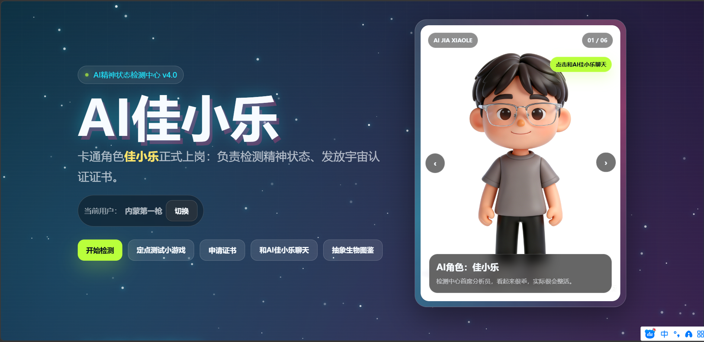
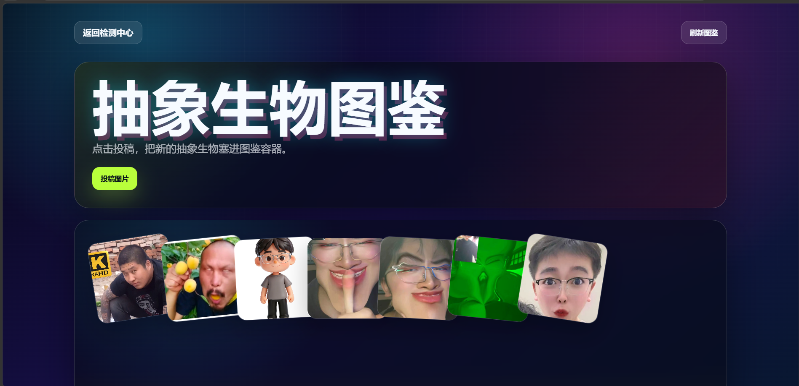

# JXL-AI：新手友好的 DeepSeek API 对话网页模板

[](https://github.com/Tuoxie423/jxl-ai)


50 行核心代码封装 DeepSeek API，用 Node.js + 原生 HTML/CSS/JS 快速搭建一个 AI 对话网页。

如果这个项目帮你跑通了第一个 AI 网页，欢迎点一个 Star 支持一下。

## 在线体验

- 访问地址：[https://tuoxie.asia/](https://tuoxie.asia/)
- 配套教程：《新手友好！50 行代码封装 DeepSeek API，快速搭建 AI 对话网页》

> [新手友好！50 行代码封装 DeepSeek API，快速搭建 AI 对话网页-CSDN博客](https://blog.csdn.net/2401_84169006/article/details/162204666?spm=1001.2014.3001.5502)。

## 效果预览

首页：



AI 聊天：


图鉴上传：



## 项目亮点

- 原生 Node.js 后端，不依赖 Express，新手更容易看懂完整链路。
- 使用 OpenAI SDK 调用 DeepSeek 兼容接口。
- 原生 HTML/CSS/JavaScript 前端，打开就能改页面。
- 支持 AI 聊天、图片投稿图鉴、SQLite 排行榜、整活证书生成。
- SQLite 本地存储，部署简单，适合个人网站和课程 Demo。
- 内置错误处理、上传限制、静态资源服务和基础安全响应头。

## 3 分钟快速启动

环境要求：

- Node.js `>= 22.5.0`
- 推荐 Node.js 24+

安装依赖：

```bash
npm install
```

配置 API Key，推荐使用环境变量：

```bash
export DEEPSEEK_API_KEY="你的 DeepSeek API Key"
```

Windows PowerShell 可以使用：

```powershell
$env:DEEPSEEK_API_KEY="你的 DeepSeek API Key"
```

启动项目：

```bash
npm start
```

浏览器访问：

```text
http://127.0.0.1:5177
```

检查项目：

```bash
npm run check
```

## DeepSeek API 配置

项目会优先读取环境变量：

```text
DEEPSEEK_API_KEY
OPENAI_API_KEY
```

也可以在根目录下创建一个 `config.yaml`：

```yaml
server:
  host: 127.0.0.1
  port: 5177

openai:
  baseURL: https://api.deepseek.com
  apiKey: 填入你的 API Key
  model: deepseek-v4-pro
```

建议不要把真实 API Key 提交到公开仓库。

## 核心思路

后端聊天接口的核心流程很简单：

```js
const client = new OpenAI({
  baseURL: "https://api.deepseek.com",
  apiKey: process.env.DEEPSEEK_API_KEY
});

const completion = await client.chat.completions.create({
  model: "deepseek-v4-pro",
  messages: [
    { role: "system", content: "你是一个友好的中文 AI 角色。" },
    { role: "user", content: userMessage }
  ]
});

const reply = completion.choices?.[0]?.message?.content;
```

完整实现见 [server.mjs](./server.mjs) 的 `/api/chat`。

## 功能说明

| 功能 | 页面/接口 | 说明 |
| --- | --- | --- |
| 首页 | `/` | AI 角色展示、检测、证书、小游戏入口 |
| AI 聊天 | `/chat.html` | 调用 DeepSeek API，失败时使用本地回复兜底 |
| 开场动画 | `/intro.html` | 角色入场动画 |
| 图鉴投稿 | `/bestiary.html` | 上传图片并展示到图鉴 |
| 排行榜 | `/api/scores` | SQLite 保存小游戏最高分 |
| 同名检查 | `/api/player?name=xxx` | 保存成绩前检查用户名是否已存在 |
| 图片投稿 | `/api/submissions` | SQLite 记录图片信息，文件保存到 `public/uploads/` |

## 项目结构

```text
.
├── server.mjs              # Node.js 后端入口
├── config.yaml             # 本地配置
├── package.json            # 项目依赖和脚本
├── scripts/
│   └── check.mjs           # HTML 脚本和资源检查
├── data/
│   └── app.db              # SQLite 数据库
├── media/                  # README 截图和 GIF
└── public/
    ├── index.html          # 首页
    ├── chat.html           # AI 聊天页
    ├── intro.html          # 开场动画
    ├── bestiary.html       # 图鉴投稿页
    ├── uploads/            # 用户上传图片
    └── assets/             # 页面静态资源
```

## 技术栈

- Node.js `node:http`
- Node.js `node:sqlite`
- OpenAI SDK，兼容 DeepSeek API
- 原生 HTML / CSS / JavaScript
- SQLite 本地数据库

## 适合谁

- 想快速跑通 DeepSeek API 的新手。
- 想做一个 AI 聊天网页 Demo 的前端/后端初学者。
- 想学习 Node.js 后端、SQLite、本地上传和 Nginx 部署完整链路的人。
- 想给自己的个人网站加一个 AI 互动页面的人。

## 作者

- GitHub: [@Tuoxie423](https://github.com/Tuoxie423)
- Gitee: [@tuoxie423](https://gitee.com/tuoxie423)

如果这个项目对你有帮助，欢迎给一个 Star。
